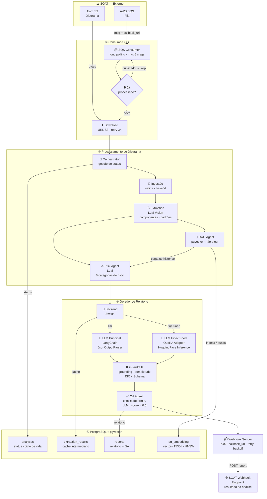

```mermaid
flowchart TD
    subgraph SOAT_EXT["☁ SOAT — Externo"]
        SQS["AWS SQS\nFila"]
        S3["AWS S3\nDiagrama"]
    end

    subgraph FASE1["① Consumo SQS"]
        Consumer["📦 SQS Consumer\nlong polling · max 5 msgs"]
        Dedup{"🔒 Já\nprocessado?"}
        Download["⬇ Download\nURL S3 · retry 3×"]
    end

    subgraph FASE2["② Processamento de Diagrama"]
        Orchestrator["🎯 Orchestrator\ngestão de status"]
        Ingestao["📁 Ingestão\nvalida · base64"]
        Extraction["🔍 Extraction\nLLM Vision\ncomponentes · padrões"]
        RAG["🔗 RAG Agent\npgvector · não-bloq."]
        Risk["⚠ Risk Agent\nLLM\n6 categorias de risco"]
    end

    subgraph FASE3["③ Gerador de Relatório"]
        Switch["🔀 Backend\nSwitch"]
        LLM_Main["🤖 LLM Principal\nLangChain\nJsonOutputParser"]
        LLM_FT["🧠 LLM Fine-Tuned\nQLoRA Adapter\nHuggingFace Inference"]
        Guardrails["🛡 Guardrails\ngrounding · completude\nJSON Schema"]
        QA["✅ QA Agent\nchecks determin.\nLLM · score > 0.6"]
    end

    subgraph DB["④ PostgreSQL + pgvector"]
        T_analyses["analyses\nstatus · ciclo de vida"]
        T_extraction["extraction_results\ncache intermediário"]
        T_reports["reports\nrelatório + QA"]
        T_embedding["pg_embedding\nvectors 1536d · HNSW"]
    end

    Webhook["📬 Webhook Sender\nPOST callback_url · retry · backoff"]
    SOAT_WH["🌐 SOAT Webhook\nEndpoint\nresultado da análise"]

    %% Fluxo principal
    SQS -- "msg + callback_url" --> Consumer
    S3 -- "bytes" --> Download
    Consumer --> Dedup
    Dedup -- "duplicado → skip" --> Consumer
    Dedup -- "novo" --> Download
    Download --> Orchestrator

    Orchestrator --> Ingestao
    Ingestao --> Extraction
    Extraction --> Risk
    RAG -- "contexto histórico" --> Risk
    Extraction --> RAG

    Risk --> Switch
    Switch -- "cache" --> T_extraction
    Switch -- "llm" --> LLM_Main
    Switch -- "finetuned" --> LLM_FT
    LLM_Main --> Guardrails
    LLM_FT --> Guardrails
    Guardrails --> QA

    %% Persistência
    Orchestrator -- "status" --> T_analyses
    QA -- "relatório" --> T_reports
    RAG -- "indexa / busca" --> T_embedding

    %% Webhook
    QA --> Webhook
    Webhook -- "POST report" --> SOAT_WH
```
